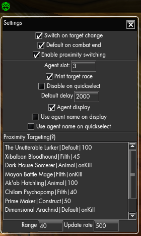

# AgentSwitcher
With the release of Occult Defence scenario Funcom released bunches of new agents, druids, which give damage bonus against certain species.  
However it can be quite hard to tell what species each enemy are (and it can be  inconsistent), not to mention the time it takes to switch the agent.
So i created this mod, which automatically switches agent in specified slot to match the enemy.  

Agent used:  
* Vampires : Default  
* Construct : Nuala Magorian  
* Cybernetic : Fearghas Abernathy  
* Demon : Laughing Jenny  
* Aquatic : Brann Mac Diarmada  
* Filth : Francis Rowan  
* Human : Lady of Mists  
* Spirit : Amelia Bindings  
* Supernatural : Sif Minervudottir  
* Undead : Lynch  
* Animal : Finn Mulligan  
* Others : Default  

Default agent is automatically set when you switch to a build.

Left-Click the icon to open QuickSelect menu, which contains your last 3 regular agents, and all your level 50 druids.  
Right-click the icon to access mod settings.  
Shift + Left-Click to Toggle mod on/off.  
Icon can be moved while in GUI-Edit mode  
  
	

### Settings  
**Switch on target change** : Switches your agent when you target an enemy  
**Targeting blacklist** : Comma-separated list of enemies that targeting based switching ignores.  
You can also override the agent choice by adding `None, Default, Construct, Cybernetic, Demon, Aquatic, Filth, Human, Spirit, Supernatural, Undead, Animal` as second argument, separated by `|` e.g  
`Familiar|Demon,mob2|Animal,mob3|Construct`  
**Default on combat end** : Switches back to your default agent x seconds after combat ends  
**Enable proximity switching** : Automatically switches agent when specified(see proximity targeting section below for configuration) enemy enters proximity.
________
**Agent Slot** : Agent slot used for switching (1-3)  
**Print race to chat** : Prints enemy race on system chat channel when targeting them  
**Print race as Fifo** : Prints enemy race as FadeIn/FadeOut message when targeting them  
**Disable on quickselect** : Disables target based switching when quickselecting(left-clicking icon) agent  
**Default delay** : Wait time for "Default on combat end" option  
**Display active agent** : Creates moveable text which displays currently equipped agent  
**Use agent name on display** : Whether display should show agents name or damage bonus.  
**Use agent name on quickselect** : Whether quickselect should show agents name or damage bonus.  
**Proximity Switching list** : See "Proximity Switching" section
________  
**Range** : When distance is not specified in the proximity list this value will be used  
**Rate** : How often tracked proximity distance is checked  
________  
### Proximity Switching:  
Format \<Name/ZoneID\>|\<Agent/Build/Outfit\>|\<Distance/Trigger\>|\<Role\>. Only name is required.  

**Name/zoneID**  
	Mob name - Targets (partial) name, case insensitive
	ZoneID - Used with onZone trigger, you can find ID after coodinates when pressing Shift + F9  

**Agent/Build/Outfit**  
	Agent - Overrides agent choice, if left unspecified then agent best suited for the mob type will be used.  
			Valid values: Construct, Cybernetic, Demon, Aquatic, Filth, Human, Spirit, Supernatural, Undead, Animal, Default or AgentID  
	Build - Build name to switch to, supports boobuilds and default GearManager  
	Outfit - Outfit to switch to, supports outfits from boobuilds  

**Distance/Trigger**  
	Number - Switches agent once target is closer than this value.  
	onKill - Changes agent/build/outfit after the specified mob is killed. Also locks switching until next combat starts.  
	onZone - Changes agent/build/outfit after zoning to specified zone  
	
**Role**  
	Tank,DPS,Healer or All - If specified then the action will only be performed if player has the right role (according to party window).  
	If not specified assumed to be all

Some examples:  
	`Xibalban Bloodhound` - Priorities Xibalban Bloodhound over adds in Darkness War 2 Fight.  
	`The Unutterable Lurker|Default|100` - Switches to default agent when Unutterable Lurker is within 100m of the player.  
	`Dark House Sorcerer|Animal|onKill` - Switches to Animal agent(Finn Mulligan) after killing Dark House Sorcerer. This is in preparation for Akab Boss.  
	`7670|Occult|onZone` - Switches to "Occult" build when entering Occult Defence  
	`5060|Single|onZone` - Switches to "Single" build when entering Agartha  
	`7740|DarkAgartha|onZone` - Switches to "DarkAgartha" build when entering DarkAgartha  
	`3140|Winter|onZone` - Switches to "Winter" outfit when entering Carpathian Fangs  
	`Machine Tyrant|CleanseTank|40|tank` - Switches to "CleanseTank" build if player is tanking and Machine Tyrant is closer than 40m to player.  
	`Machine Tyrant|Tank|onKill|tank` - Switches to "Tank" build if player kills Machine Tyrant as a tank.
