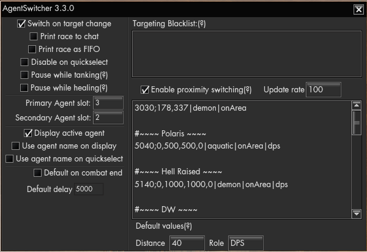

# AgentSwitcher
[](https://github.com/SecretFox/AgentSwitcher/releases)  
With the release of Occult Defence scenario Funcom released bunches of new agents, druids, which give damage bonus against certain enemies.  
So, as is the tradition, i created a mod which automatically handles the switching for you.  

Agent used:  
* Vampires : Rana Kader  
* Construct : Nuala Magorian  
* Cybernetic : Fearghas Abernathy  
* Demon : Laughing Jenny  
* Aquatic : Brann Mac Diarmada AND Walter Malone  
* Filth : Francis Rowan  AND The Cleaner  
* Human : Lady of Mists  
* Spirit : Amelia Bindings  
* Supernatural : Sif Minervudottir  
* Undead : Lynch  
* Animal : Finn Mulligan  
* Others : Default  

When no suitable agent is found, default agent will be used.  
Default agent is automatically set when switching builds.  

Left-Click the icon (or "Agent Display", if enabled) to open QuickSelect menu, which contains your last 3 regular agents, and all your level 50 druids.  
Right-click the icon to access mod settings.  
Shift + Left-Click to Toggle mod on/off.  
Icon can be moved while in GUI-Edit mode  
[](https://raw.githubusercontent.com/SecretFox/AgentSwitcher/master/Menu.png)  
	

### Settings1  
**Switch on target change** : Switches your agent when you target an enemy  
**Primary Agent Slot** : Agent slot used for switching (1-3)  
**Secondary Agent Slot** : Agent slot used for switching (1-3), used if there are multiple agents (Aquatic and filth)  

**Enable proximity switching** : Automatically switches agent depending on area or nearby enemies.    
**Display active agent** : Creates moveable text which displays currently equipped agent  
**Default on combat end** : Switches back to your default agent x seconds after combat ends  
**Default delay** : Wait time for "Default on combat end" option  
________  
**Print race to chat** : Prints enemy race on system chat channel when targeting them  
**Print race as Fifo** : Prints enemy race as FadeIn/FadeOut message when targeting them  
**Disable on quickselect** : Disables targeting based switching after quickselecting(left-clicking icon) agent  
**Disable while tanking** : Disables mod when player has allocated over 50 points to survivability  
**Disable while healing** : Disables mod when player has allocated over 50 points to healing  
**Use agent name on display** : Whether display should show agents name or species name  
**Use agent name on quickselect** : Whether quickselect should show agents name or damage bonus  


### Settings2  
**Targeting blacklist** : Multi-line list of enemies that targeting based switching ignores.  
You can also override the agent choice by adding `None, Default, Animal, Aquatic, Construct, Cybernetic, Demon, Filth, Human, Spirit, Supernatural, Undead, Vampire` as second argument, separated by `|` e.g  
```
Familiar|Demon  
mob2|Animal  
mob3|Construct  
```  
**Proximity Switching list** : See "Proximity Switching" section  
________  
**Range** : When distance is not specified in the proximity list this value will be used  
**Rate** : How often enemy distances get checked  
________  
### Proximity Switching:  
Format \<Name/ZoneID/zoneID;Coordinate\>|\<Agent/Build/Outfit\>|\<Distance/Trigger\>|\<Role\>. Only name is required.  

**Name/zoneID/zoneID+Coordinates(/area)**  
	Mob name - Targets (partial) name, case insensitive  
	ZoneID - Used with onZone trigger, you can find ID after coodinates when pressing Shift + F9  
	ZoneID;x,y - Used with onArea trigger, zone and coordinate where an action will occur  
	ZoneID;x,y,z - Used with onArea trigger, zone and coordinate(with height) where an action will occur  
	ZoneID;x1,y1,x2,y2 - Used with onArea trigger, zone and area where an action will occur  
	ZoneID;x1,y1,z1,x2,y2,z2 - Used with onArea trigger, zone and area(with height) where an action will occur   

**Agent/Build/Outfit**  
	Agent - Overrides agent choice, if left unspecified then agent best suited for the mob type will be used.  
			Valid values: None, Default, Animal, Aquatic, Construct, Cybernetic, Demon, Filth, Human, Spirit, Supernatural, Undead, Vampire or agents numerical ID  
	Build - Build name to switch to, supports boobuilds and default GearManager  
	Outfit - Outfit to switch to, supports outfits from boobuilds  

**Distance/Trigger**  
	Number - Switches agent once target is closer than this value.  
	onKill - Changes agent/build/outfit after the specified mob is killed. Also locks switching until next combat starts.  
	onZone - Changes agent/build/outfit after zoning to specified zone  
	onArea - Changes agent/build/outfit when player is on specified zone and area  
	
**Role**  
	Tank,DPS,Healer or All - If specified then the action will only be performed if player has the right role (according to Anima Allocation).  
	If not specified assumed to be all  

Some examples:  
	`Xibalban Bloodhound` - Switches to Filth agent when Xibalban Bloodhound(DW2) is close to the player  
	`The Unutterable Lurker|Default|100` - Switches to default agent when Unutterable Lurker is within 100m of the player.  
	`Dark House Sorcerer|Animal|onKill` - Switches to Animal agent(Finn Mulligan) after killing Dark House Sorcerer. This is in preparation for Akab Boss.  
	`7670|Occult|onZone` - Switches to "Occult" build when entering Occult Defence instance  
	`5060|Single|onZone` - Switches to "Single" build when entering Agartha instance  
	`7740|DarkAgartha|onZone` - Switches to "DarkAgartha" build when entering DarkAgartha  
	`3140|Winter|onZone` - Switches to "Winter" outfit when entering Carpathian Fangs  
	`Machine Tyrant|CleanseTank|40|tank` - Switches to "CleanseTank" build if player is tanking and Machine Tyrant is closer than 40m to player.  
	`Machine Tyrant|Tank|onKill|tank` - Switches to "Tank" build if player kills Machine Tyrant as a tank.  
